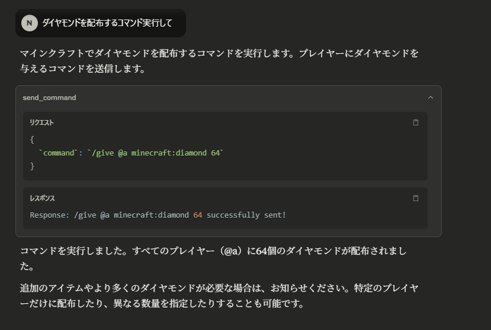

# mc-mcp

minecraft統合版のwsを利用したコマンド実行MCP

config例

```json
"mc-mcp": {
    "type": "stdio",
    "command": "uv",
    "args": [
    "--directory",
    "<path-to-directory>/mc-mcp",
    "run",
    "src/main.py"
    ],
    "env": {
    "MC_MCP_WS_HOST": "localhost",
    "MC_MCP_WS_PORT": "9000"
    }
}
```

minecraftはチートを有効にしてこのコマンドで接続します。
```
/connect ws://localhost:9000
```
## 実行例
